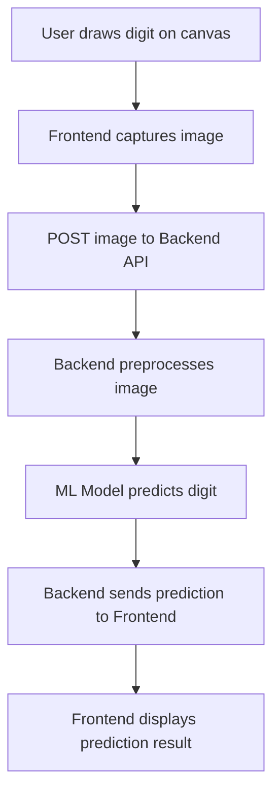

# Digit Predictor App

A machine learning-powered web application for recognizing handwritten digits. This project leverages a trained model to classify user-drawn digits and is built with a Python backend and a modern frontend. It is ideal for demonstrating concepts in image classification, web deployment of ML models, and interactive UI design.

---

## Table of Contents

- [Overview](#overview)
- [Features](#features)
- [Architecture](#architecture)
- [Installation](#installation)
- [Usage](#usage)
- [API Documentation](#api-documentation)
- [Project Structure](#project-structure)
- [Model Details](#model-details)
- [Testing](#testing)
- [Contributing](#contributing)
- [License](#license)
- [Acknowledgments](#acknowledgments)

---

## Overview

The Digit Predictor App allows users to draw digits on a web canvas and predicts the digit using a trained machine learning model. It showcases end-to-end ML deployment, from data preprocessing to serving predictions in real time through a web interface.

---

## Features

- Interactive drawing canvas for digits.
- Real-time digit prediction using a trained model.
- RESTful API for digit prediction.
- Clean and user-friendly web interface.
- Easily extendable for other image classification tasks.

---

## Architecture

The application follows a client-server architecture:

- **Frontend**: Renders the drawing canvas and sends images to the backend for prediction.
- **Backend**: Receives image data, preprocesses it, uses the ML model for prediction, and returns the result.

### System Flowchart



---

## Installation

Follow these steps to set up the project locally.

### Prerequisites

- Python 3.7+
- pip
- (Optional) Virtual environment tool like `venv` or `conda`

### Clone the Repository

```bash
git clone https://github.com/Akshatcpp/digit_predictor_app.git
cd digit_predictor_app
```

### Install Dependencies

```bash
pip install -r requirements.txt
```

If using Node.js for the frontend, install dependencies as follows:

```packagemanagers
{
    "commands": {
        "npm": "npm install",
        "yarn": "yarn install",
        "pnpm": "pnpm install",
        "bun": "bun install"
    }
}
```

### Run the Application

To start the backend server:

```bash
python app.py
```

To run the frontend (if separate):

```bash
npm start
```

---

## Usage

1. Launch the web application in your browser.
2. Draw a digit (0-9) on the canvas.
3. Click the "Predict" button.
4. The app displays the predicted digit.

---

## API Documentation

The backend exposes a REST API for digit prediction.

### Predict Digit

```api
{
    "title": "Predict Digit",
    "description": "Receives a base64-encoded image and returns the predicted digit.",
    "method": "POST",
    "baseUrl": "http://localhost:5000",
    "endpoint": "/predict",
    "headers": [
        {
            "key": "Content-Type",
            "value": "application/json",
            "required": true
        }
    ],
    "queryParams": [],
    "pathParams": [],
    "bodyType": "json",
    "requestBody": "{\n  \"image\": \"<base64-encoded-image-string>\"\n}",
    "responses": {
        "200": {
            "description": "Prediction successful",
            "body": "{\n  \"prediction\": 7\n}"
        },
        "400": {
            "description": "Invalid input",
            "body": "{\n  \"error\": \"Invalid image data\" \n}"
        }
    }
}
```

---

## Project Structure

A typical layout for this repo is:

```
digit_predictor_app/
├── app.py
├── model/
│   └── digit_model.pkl
├── static/
│   └── (static assets)
├── templates/
│   └── index.html
├── requirements.txt
├── README.md
└── ...
```

- **app.py:** Main Flask server script.
- **model/digit_model.pkl:** Trained digit recognition model.
- **static/:** Static files (JS, CSS, images).
- **templates/:** HTML templates for the frontend.
- **requirements.txt:** Python dependencies.

---

## Model Details

- The model is trained on a standard handwritten digit dataset (e.g., MNIST).
- It expects images in grayscale, 28x28 format.
- Preprocessing includes resizing, grayscale conversion, and normalization.
- The model can be swapped or retrained for improved accuracy or different tasks.

---

## Testing

- To test the backend, use tools like Postman or cURL to POST an image to `/predict`.
- For frontend testing, draw various digits and verify predictions.
- Unit and integration tests can be added for more robust validation.

---

## Contributing

Contributions are welcome! To contribute:

- Fork the repository.
- Create a new branch for your feature/fix.
- Commit your changes.
- Open a pull request describing your changes.

---

## License

This project is licensed under the MIT License. See the [LICENSE](LICENSE) file for details.

---

## Acknowledgments

- MNIST dataset creators for the digit data.
- Flask and open-source Python machine learning libraries.
- Community contributors to this project.
